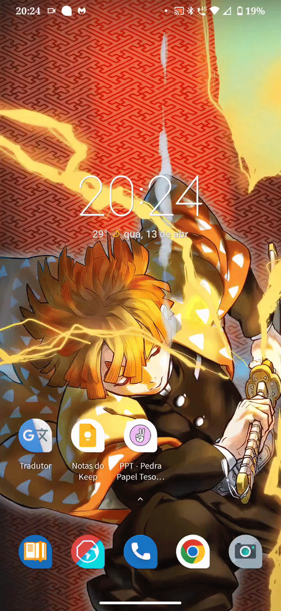

# Pedra Papel Tesoura ;-)

Um projeto Flutter 😁🌟🌠

## Sobre

Este é um incrível jogo de Pedra, Papel Tesoura -> 🪨📜✂️

Seguindo as regras clássicas do jogo 👍

Basta escolher uma das opções que a jogada é feita ✅

No lado esquerdo há a escolha do jogador, no lado direito há a escolha da máquina (aleatória 👀)

Após a escolha, é verificado quem ganhou. Quem ganhou recebe um círculo verde para indicar a vitória e o placar é contabilizado de acordo 🙃

Ahhh e tem um botão de reset do jogo no canto superior direito ✌️✌️

